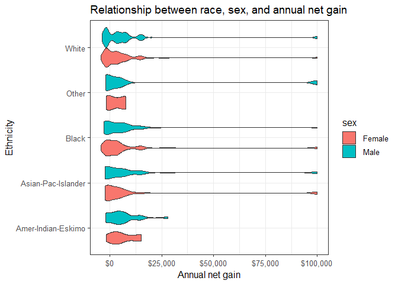

## Introduction 

The economic well-being of individuals is reliant on their income, where income is defined as the money an individual (or household) receives on a regular basis. In the United States, the Census Bureau uses income  (money received before expenses and deductions) to gauge the population's range of poverty, wealth, and financial security (United States Census Bureau, 2016). There are a variety of factors that can influence one's income, including socioeconomic drivers, education and vocation. This project examines some of the variables that are often related to income. 

## Description of Dataset

This project works with a dataset of adult incomes obtained from the University of California Irvine (UCI) [Machine Learning Repository](https://archive.ics.uci.edu/ml/datasets/adult). The data was donated by Ronny Kohavi and Barry Becker (Silicon Graphics) and was originally extracted by Barry Becker from the 1994 Census database and used for machine learning predictions of whether a person makes over $50,000 per year based on personal factors.

This 1994 income census dataset consists of multivariate categorical and integer data that describe socioeconomic and personal classifiers of adults across the USA. Each instance (32,561) is an individual whose annual income was grouped as either above or below $50,000. Table 1 shows an overview of the 15 attributes (variables), including whether each is categorical or integer and a brief interpretation of the variable.  

<!--html_preserve--><div id="htmlwidget-9e76b5125105b1b5540d" style="width:100%;height:auto;" class="datatables html-widget"></div>
<script type="application/json" data-for="htmlwidget-9e76b5125105b1b5540d">{"x":{"filter":"none","caption":"<caption>description of adult income dataset variables<\/caption>","data":[["1","2","3","4","5","6","7","8","9","10","11","12","13","14","15"],["age","workclass","fnlwgt","education","education-num","marital-status","occupation","relationship","race","sex","capital-gain","capital-loss","hours-per-week","native-country","label"],["continuous","categorical","continuous","categorical","continuous","categorical","categorical","categorical","categorical","categorical","continuous","continuous","continuous","categorical","categorical"],["age, range from 17 to 90 (mean 38.58)","Private, Self-emp-not-inc, Self-emp-inc, Federal-gov, Local-gov, State-gov, Without-pay, Never-worked.","\"final weight\" - demographic weight by US state controlled by three sets of characteristics including race/age/sex, hispanic origin, and proportion of state population over 16 years of age","Bachelors, Some-college, 11th, HS-grad, Prof-school, Assoc-acdm, Assoc-voc, 9th, 7th-8th, 12th, Masters, 1st-4th, 10th, Doctorate, 5th-6th, Preschool.","years of education. Range from 1 to 16 (mean 10.08)","Married-civ-spouse, Divorced, Never-married, Separated, Widowed, Married-spouse-absent, Married-AF-spouse.","Tech-support, Craft-repair, Other-service, Sales, Exec-managerial, Prof-specialty, Handlers-cleaners, Machine-op-inspct, Adm-clerical, Farming-fishing, Transport-moving, Priv-house-serv, Protective-serv, Armed-Forces.","Wife, Own-child, Husband, Not-in-family, Other-relative, Unmarried.","White, Asian-Pac-Islander, Amer-Indian-Eskimo, Other, Black.","Female, Male","range from 0 to 99999 (mean 1078). Assuming this is annual financial gains in $USD.","range from 0 to 4356 (mean 87.3). Assuming this is annual financial losses in $USD.","average hours worked per week. Range from 1 to 99 (mean 40.44)","United-States, Cambodia, England, Puerto-Rico, Canada, Germany, Outlying-US(Guam-USVI-etc), India, Japan, Greece, South, China, Cuba, Iran, Honduras, Philippines, Italy, Poland, Jamaica, Vietnam, Mexico, Portugal, Ireland, France, Dominican-Republic, Laos, Ecuador, Taiwan, Haiti, Columbia, Hungary, Guatemala, Nicaragua, Scotland, Thailand, Yugoslavia, El-Salvador, Trinadad&amp;Tobago, Peru, Hong, Holand-Netherlands.","annual income above or below threshold of $50000: &gt;50K or &lt;=50K"]],"container":"<table class=\"display\">\n  <thead>\n    <tr>\n      <th> <\/th>\n      <th>Variable<\/th>\n      <th>Type<\/th>\n      <th>Description<\/th>\n    <\/tr>\n  <\/thead>\n<\/table>","options":{"order":[],"autoWidth":false,"orderClasses":false,"columnDefs":[{"orderable":false,"targets":0}]}},"evals":[],"jsHooks":[]}</script><!--/html_preserve-->

### Notes on original dataset

A couple of assumptions were made about these data based on information on the Census website. It was assumed that "capital gains" indicate non-cash financial benefits (e.g., food stamps, health benefits, subsidized housing or transportation, employer contributions to retirement programs, medical and educational expenses, etc.), and that "capital losses" include non-cash expenses (such as depreciated value of assets). We also assumed that "education number" indicated the number of years allotted to education.  

It is of note that these data are from 1994 census, and the income threshold of $50,000 held a different meaning for wealth than it holds today. Additionally, as this dataset includes socioeconomic attributes, it's worth noting that the majority of data instances were dominated by middle-age, white, US-born, male, private-sector employees. Overall, there appeared to be a fairly even distribution of individuals across occupational sectors and the majority of individuals work approximately 40 hours per week.


## Project Objectives

This project developed data analysis skills in R and R studio with a strong focus on writing Rscripts and executing script commands via RStudio Terminal or the command line. The ultimate goal was to generate a full report using a pipeline of scripts, run in sequence, and to create a report using 'Make'.

### EDA Research Questions

In this study, we explored the relationships between personal attributes and quantitative income-related variables with the goal of identifying relationships and interesting patterns. We focused on addressing the following exploratory research questions: 

1. Is there an observable relationship between personal attributes data and income level?
2. Does the number of hours worked per week relate more to occupation, sex, race, age (or is there no clear relationship)?
3. What is the relationship between education and hours worked per week (e.g. does a person work fewer hours if they have completed more schooling)?

### Plan of Action

The variables that effect income may be confounding and are unlikely to be direct, therefore these data may not be appropriate for linear regression analyses. We focus on exploring the relationships variables and identifying relationships and patterns through the initial project's exploratory data analysis and first steps of running a data analysis pipeline. 

## Exploratory Data Analysis 

The original data set was loaded into RStudio where we ran a summary and performed initial exploratory data analysis. A key discovery was that the variable 'income' was not (as might be expected) annual income values for each data instance, it was instead a categorical variable that distinguished whether that instance (row value, person) had earned more than or less than $50,000 USD. Below is a summary of the initial dataset. 


```r
# read original data file 
dat <- read.table(here("data", "adult.data"), sep = ",", header = FALSE,
                  col.names = c("age", "workclass", "fnlwgt", "education", "education-num", "martial_status", "occupation", "relationship", "race", "sex", "capital-gain", "capital-loss", "hours-per-week", "native-country", "label"))

# Summary overview
summary(dat)
```

```
##       age                    workclass         fnlwgt       
##  Min.   :17.00    Private         :22696   Min.   :  12285  
##  1st Qu.:28.00    Self-emp-not-inc: 2541   1st Qu.: 117827  
##  Median :37.00    Local-gov       : 2093   Median : 178356  
##  Mean   :38.58    ?               : 1836   Mean   : 189778  
##  3rd Qu.:48.00    State-gov       : 1298   3rd Qu.: 237051  
##  Max.   :90.00    Self-emp-inc    : 1116   Max.   :1484705  
##                  (Other)          :  981                    
##          education     education.num                  martial_status 
##   HS-grad     :10501   Min.   : 1.00    Divorced             : 4443  
##   Some-college: 7291   1st Qu.: 9.00    Married-AF-spouse    :   23  
##   Bachelors   : 5355   Median :10.00    Married-civ-spouse   :14976  
##   Masters     : 1723   Mean   :10.08    Married-spouse-absent:  418  
##   Assoc-voc   : 1382   3rd Qu.:12.00    Never-married        :10683  
##   11th        : 1175   Max.   :16.00    Separated            : 1025  
##  (Other)      : 5134                    Widowed              :  993  
##             occupation            relationship                    race      
##   Prof-specialty :4140    Husband       :13193    Amer-Indian-Eskimo:  311  
##   Craft-repair   :4099    Not-in-family : 8305    Asian-Pac-Islander: 1039  
##   Exec-managerial:4066    Other-relative:  981    Black             : 3124  
##   Adm-clerical   :3770    Own-child     : 5068    Other             :  271  
##   Sales          :3650    Unmarried     : 3446    White             :27816  
##   Other-service  :3295    Wife          : 1568                              
##  (Other)         :9541                                                      
##       sex         capital.gain    capital.loss    hours.per.week 
##   Female:10771   Min.   :    0   Min.   :   0.0   Min.   : 1.00  
##   Male  :21790   1st Qu.:    0   1st Qu.:   0.0   1st Qu.:40.00  
##                  Median :    0   Median :   0.0   Median :40.00  
##                  Mean   : 1078   Mean   :  87.3   Mean   :40.44  
##                  3rd Qu.:    0   3rd Qu.:   0.0   3rd Qu.:45.00  
##                  Max.   :99999   Max.   :4356.0   Max.   :99.00  
##                                                                  
##         native.country     label      
##   United-States:29170    <=50K:24720  
##   Mexico       :  643    >50K : 7841  
##   ?            :  583                 
##   Philippines  :  198                 
##   Germany      :  137                 
##   Canada       :  121                 
##  (Other)       : 1709
```

### Data handling

Summary of the original data showed that 'capital-gains' and 'capital-losses' were not categorical values like the 'income' variable, and while these variables were numeric, there were many 'zero' values for capital gains and losses. Because the 'income' variable in this dataset was a binary category (above or below $50K) the capital gains and losses appeared to be a more interesting metric in gauging wealth for the individuals in the Census. Therefore, we filtered the dataset to include only instances when there was a non-zero value for capital gains or losses, then combined values of gains and losses to create a 'net' capital gain variable. The filtering we performed was similar to this process: 
```
# remove rows that contain zeroes for both capital gain and loss 
# merge capital-gain and capital-loss into a single 'net' variable

dat.filt <- dat %>% 
  filter(capital.gain != capital.loss) %>% 
  mutate(net = if_else(capital.gain == 0, 
  as.numeric(capital.loss)*-1,         # transform capital-loss to negative values 
  as.numeric(capital.gain))) %>% 
  mutate(race = factor(trimws(race)),  # remove leading white spaces, convert to factor
  sex = factor(sex))                   # convert sex to factor
```
To create a data analysis pipeline, data filtering was performed with Rscripts executed via command line arguments in the RStudio Terminal. The resulting filtered dataframe (augmented by filtering for instances that included capital gains and losses) the data demographics were shifted to slightly older individuals represented by more men than women. Below is a summary of the filtered dataframe.


```r
# read cleaned data file 
# cleaned in "data_processing2.R" script 
# original data downloaded in "load_data.R" script
dat <- read.table(here("data", "adult.data.processed"), sep = ",", header = TRUE)

# Summary overview
summary(dat)
```

```
##       age                    workclass        fnlwgt       
##  Min.   :17.00    Private         :2714   Min.   :  19302  
##  1st Qu.:34.00    Self-emp-not-inc: 413   1st Qu.: 118347  
##  Median :42.00    Local-gov       : 321   Median : 175669  
##  Mean   :43.18    Self-emp-inc    : 284   Mean   : 187152  
##  3rd Qu.:51.00    ?               : 181   3rd Qu.: 234292  
##  Max.   :90.00    State-gov       : 164   Max.   :1033222  
##                  (Other)          : 154                    
##          education    education.num                  martial_status
##   HS-grad     :1086   Min.   : 1.00    Divorced             : 453  
##   Bachelors   : 971   1st Qu.: 9.00    Married-AF-spouse    :   2  
##   Some-college: 758   Median :10.00    Married-civ-spouse   :2777  
##   Masters     : 423   Mean   :11.03    Married-spouse-absent:  35  
##   Prof-school : 213   3rd Qu.:13.00    Never-married        : 769  
##   Assoc-voc   : 188   Max.   :16.00    Separated            :  81  
##  (Other)      : 592                    Widowed              : 114  
##               occupation           relationship                  race     
##   Prof-specialty   :850    Husband       :2454   Amer-Indian-Eskimo:  31  
##   Exec-managerial  :847    Not-in-family : 878   Asian-Pac-Islander: 137  
##   Sales            :512    Other-relative:  71   Black             : 285  
##   Craft-repair     :506    Own-child     : 258   Other             :  23  
##   Adm-clerical     :362    Unmarried     : 274   White             :3755  
##   Machine-op-inspct:196    Wife          : 296                            
##  (Other)           :958                                                   
##       sex        capital.gain    capital.loss    hours.per.week 
##   Female: 992   Min.   :    0   Min.   :   0.0   Min.   : 1.00  
##   Male  :3239   1st Qu.:    0   1st Qu.:   0.0   1st Qu.:40.00  
##                 Median : 3137   Median :   0.0   Median :40.00  
##                 Mean   : 8293   Mean   : 671.9   Mean   :43.42  
##                 3rd Qu.: 7688   3rd Qu.:1740.0   3rd Qu.:50.00  
##                 Max.   :99999   Max.   :4356.0   Max.   :99.00  
##                                                                 
##         native.country    label           net       
##   United-States:3850    <=50K:1781   Min.   :-4356  
##   ?            :  90    >50K :2450   1st Qu.:-1740  
##   Mexico       :  31                 Median : 3137  
##   Philippines  :  24                 Mean   : 7622  
##   India        :  21                 3rd Qu.: 7688  
##   Germany      :  20                 Max.   :99999  
##  (Other)       : 195
```

### EDA: Relationship between education attainment and annual net gain

As part of exploratory data analysis, we visualized some relationships among the data. A script was written to generate a box plot of annual net gain across education levels. The code was similar to the following chunk, and generated Figure 1, which follows.
```
# generate boxplot of annual net gain across education levels
dat.filt %>% 
  ggplot(aes(x = education, y = net)) +
  geom_boxplot() +
  coord_flip() +
  scale_y_continuous(labels = scales::dollar_format()) +
  theme_bw(12) +
  labs(x = "Education attainment level",
  y = "Annual net gain",
  title = "Relationship between education attainment and annual net gain")
```


```r
knitr::include_graphics(here("images/net_education_plot.png"))
```

<div class="figure" style="text-align: center">

<p class="caption">Figure 1: Boxplot of annual net capital gain across education levels</p>
</div>

Figure 1 shows that minimal correlation between annual net gain and education attainment. However, there appeared to be a greater spread in annual net gain for individuals with at least a high school diploma, and persons with professional school education demonstrated the highest median in annual net gain.

### EDA: Relationship between race, gender and annual net gain

We were interested to see if there were any visible patterns between annual net gain and individucal's race and or gender. In the inital exploratory data analysis, we examined the relationships between annual net gain across race and gender. 

```r
# generate violin plots of annual net gain across race and gender
dat %>% 
  ggplot(aes(x = race,
             y = net, fill = sex)) +
  geom_violin() +
  coord_flip() +
  scale_y_continuous(labels = scales::dollar_format()) +
  theme_bw(12) +
  labs(x = "Ethnicity",
       y = "Annual net gain",
       title = "Relationship between race, sex, and annual net gain")
```

<div class="figure" style="text-align: center">

<p class="caption">Figure 2: Violin plot of annual net capital gain by ethnicity and sex</p>
</div>

There did not appear to be any significant differences in annual net gain between sex across all ethnic groups (Figure 2). Moreover, no obvious correlation between ethnicity and annual net gain was observed.

### EDA: Correlation between work hours per week and annual net gain

We generated an additional script as part of the data analysis pipeline, to plot the relationship between annual net gain and hours worked per week. We categorized work hours per week as being short (under 25 hrs), medium (between 25 and 50), long (50-75 hrs/wk) and very long (over 75 hrs/wk).

```
# generate a box plot of annual net gain across work hours
dat.filt %>% 
  filter(net != 99999) %>%
  # define a new variable to bin work hours per week into 4 categories
  mutate(work_hours = factor(
    case_when(hours_per_week <= 25 ~ "Short", 
              hours_per_week > 25 & hours_per_week <= 50 ~ "Medium",
              hours_per_week > 50 & hours_per_week <= 75 ~ "Long",
              TRUE ~ "Very Long"),
    levels = c("Short", "Medium", "Long", "Very Long"))) %>% 
  ggplot(aes(x = work_hours, y = net)) +
  geom_boxplot() +
  theme_bw(12) +
  guides(fill = F) +
  scale_y_continuous(labels = scales::dollar_format()) +
  labs(x = "Work Hours",
       y = "Annual net gain",
       title = "Relationship between work hours per week and annual net gain")
```


```r
knitr::include_graphics(here("images/net_work_hours_plot.png"))
```

<div class="figure" style="text-align: center">

<p class="caption">Figure 3: Plot of annual net capital gain by hours worked per week</p>
</div>

From the above boxplot, there appears to be an increase in annual net gain from short to long work hours. However, the differences may not be significant because greater variance in annual net gain is observed for individuals with long work hours.

## Linear Regression

A goal of this project was to generate a linear model for later use. The 'adult income' dataset did not have many linear relationships, so we isolated a section of data which showed a more direct relationship between variables in order to accomplish the scripting task of creating a linear model. Figure 4 shows scatter plots of the relationship between hours worked per week and age of worker, including the full dataset and a subsection with a near-linear trend.


```r
p1 <- dat %>% 
  ggplot(aes(x = age, y = hours.per.week))+
  geom_jitter(alpha = 0.4)+
  theme_bw()+
  labs(y = "hrs/wk", x = "")

p2 <- dat %>% 
  filter(age < 30,
         hours.per.week != 40, hours.per.week >= 10) %>% 
  ggplot(aes(x = age, y = hours.per.week))+
  geom_jitter(alpha = 0.4)+
  geom_smooth(method = lm)+
  labs(y = "hrs/wk", x = "age of worker")+
  ggpmisc::stat_poly_eq(formula = y ~ x, 
               aes(label = paste(..eq.label.., ..rr.label.., sep = "~~~")), 
               parse = TRUE, rr.digits = 3)+
  theme_bw()

# arrange plots
cowplot::plot_grid(p1, p2, align = "v", nrow = 2,
                   labels = c("A", "B"))
```

<div class="figure" style="text-align: center">

<p class="caption">Figure 4: Hours worked per week by age where plot 'A' shows the full dataset and plot 'B' shows a more linear section of filtered data (for workers under 30)</p>
</div>

The relationship between age and hours worked appeared to be loosely parabolic. Work hours increased with age until approximately age 30-50, at which time work hours stabilize before beginning to decrease with age up to approximately 80 years old (Figure 4-A). In order to perform a linear regression, we isolated the earlier part of this data, for workers under the age of 30 who worked more than 10 hours per week and not standard full time of 40 hours per week (Figure 4-B).

We wrote a script to generate a linear model based on the filtered data shown in Figure 4-B, as well as a script to generate that sub-plot as a stand-alone graphic.


```r
knitr::include_graphics(here("images/linear-regression_plot.png"))
```

<div class="figure" style="text-align: center">

<p class="caption">Figure 5: Plot of linear regression model data for hours worked by those under age 30</p>
</div>

## References

United States Census Bureau, 2016. Income and Poverty, 'about income'.
https://www.census.gov/topics/income-poverty/income/about.html

University of California Irvine, Machine Learning Repository. https://archive.ics.uci.edu/ml/datasets/adult.
